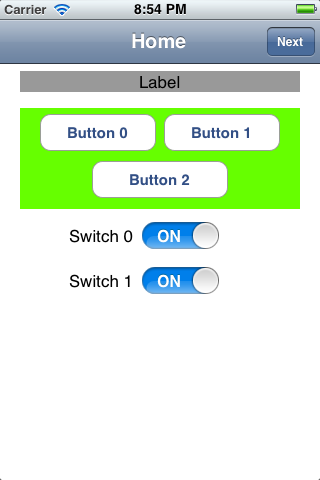
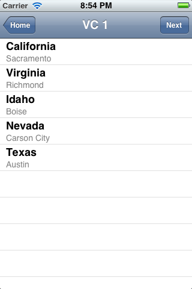
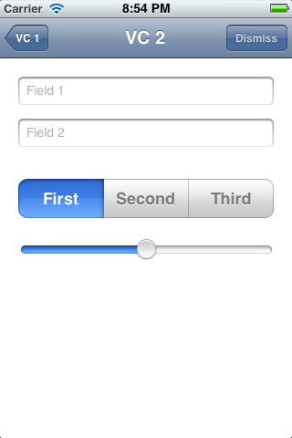

<html>
<head>
<title>Towards a Conceptual Understanding of UI Automation or "Look Ma, No Hands!"</title>

</head>
<body>
# FIRST DRAFT: DO NOT DISTRIBUTE

# Towards a Conceptual Understanding of UI Automation or "Look Ma, No Hands!"

## Synopsis 
UI Automation in Instruments maps the current view hierarchy of an iOS app to a dynamic hierarchical collection of JavaScript objects (JSOs). As the app view hierarchy changes, the JSOs change accordingly. With UI Automation, this post suggests to think of your app as a hierarchical collection of JSOs first. 

## Introduction
WWDC 2010 saw the introduction of UI Automation which let folks write UI tests for UIKit-based apps. Seeing this shiny new toy, of course I wanted to play with it. However, the (still) sparse documentation provided by Apple made it difficult to figure out what was going on in quick fashion. First you needed to understand JavaScript. You also needed to understand *how* JavaScript was being used by UI Automation to inspect your app's UI. This understanding is different from how you would think of it from a UIKit API perspective (thinking of it as a hierarchy of UIViews) and is what I suspect to be the source for many iOS devs "not getting it" at first glance.

### Disclaimer
This post seeks to offer clarity on using UI Automation, but makes no claim to be authoritative on describing it. This post is also not a primer on using UI Automation in Instruments. Please refer to the section *Built-in Instruments > UI Automation* section in the 
[Instruments User Guide](https://developer.apple.com/library/mac/#documentation/developertools/conceptual/InstrumentsUserGuide/Built-InInstruments/Built-InInstruments.html) for this.

## The Basic Idea

UI Automation in the **Instruments** tool inspects the view hierarchy of a UIKit-based app and constructs a tree of JavaScript objects that maps correspondingly to that view hierarchy. Each node of the JSO tree has a type that inherits from [`UIAElement`](https://developer.apple.com/library/ios/documentation/ToolsLanguages/Reference/UIAElementClassReference/UIAElement/UIAElement.html#//apple_ref/doc/uid/TP40009903). 

**All user interface elements are based off the JavaScript `UIAElement` superclass.**

The top-most node of this tree is accessed typically with this kind of method call chain:

<code>
var topNode = UIATarget.localTarget().frontMostApp().mainWindow();
</code>

In the above code, `topNode` is a JavaScript instance of type `UIAWindow` which inherits from `UIAElement`. 
`UIAElement` has methods which can query whether the instance has any user interface elements of a particular type. For example, 

* `topNode.elements()` will return an array of all `UIAElement` instances that are direct children of `topNode`.
* `topNode.buttons()` will return an array of all `UIAButton` instances that are direct children of `topNode`.
* `topNode.tableViews()` will return an array of all `UIATableView` instances that are direct children of `topNode`.
* `topNode.textFields()` will return an array of all `UIATextField` instances that are direct children of `topNode`.
* and so forth... (please refer to the Apple `UIAElement` reference documentation for all methods)

`UIAElement` instances can also respond to gestures and actions. Example methods include:

* `tap()`
* `touchAndHold()`
* `doubleTap()`

### UIKit - UI Automation JavaScript Mapping
To understand how this JavaScript object tree maps to a UIView hierarchy, let's apply this to the figure below:

In this case, we start with the same definition for `topNode` to get the first view:

<code>
var topNode = UIATarget.localTarget().frontMostApp().mainWindow();
</code>

<table border=1 width='80%'>
<tr><th colspan='2'>UIKit - UI Automation JS Mapping</th></tr>
<tr><th>UIKit</th><th>UI Automation JS</th></tr>
<tr><td>UIWindow+UIView</td><td><code>var topNode = UIATarget.localTarget().frontMostApp().mainWindow();<code></td></tr>
<tr><td>UILabel</td><td><code>topNode.staticTexts()[0]<code></td></tr>
<tr><td>UIButton</td><td><code>topNode.buttons()[0]<code></td></tr>
</table>

Since there is only one `UILabel` instance, it can be accessed in the array returned by `topNode.staticTexts()` with the value 0. Similarly this is the case for `UIButton`. UI elements can be accessed by *name* as well, provided that the UI element has been configured using Interface Builder so that its *Accessibility* field is checked and a *Label* has been defined. So if in the case of the `UIButton`, its *Accessibility* field is checked and the *Label* has been set to "foo", then it could be accessed as `topNode.buttons()['foo']`.

Note that the UIA JavaScript object tree *flattens the standard `UIView` hierarchy* so that child objects within a standard `UIView` that is the child of the parent view in `UIWindow` will be listed from `topNode`. The exceptions are objects within a `UIScrollView` (mapped to the JS `UIAScrollView`) and other objects which inherit from it (`UIATableView`, `UIAWebView`).

## UI Changes

From an iOS SDK perspective, the app view hierarchy can change either within the view controller or via navigation of different view controllers. 

**The UI Automation JavaScript object tree does not directly keep track of UIViewController behavior. It only keeps track of resultant changes to the view hierarchy based on UIViewController behavior.**

Following the example from Figure 1-1 above, if the `UIButton`'s action was to push another `UIViewController` into view, here is example code that would accomplish that:

> <code>
var target = UIATarget.localTarget(); 
var app = target.frontMostApp(); 
var topNode = app.mainWindow(); 
var button = topNode.buttons()[0]; 
button.tap(); 
</code>

Note that after the `tap()` method is called:

1. A different UIViewController with a different view hierarchy is put in place.
2. UI Automation detects this (after some latency, especially if animation is used to transition) and reconstructs the JavaScript object tree.
3. `topNode` methods returning `UIAElements` (e.g. `buttons()`) would be different reflecting the new view hierarchy.

The latency is an issue in getting the sequence of events to send right to your app. Please refer to `UIATarget.pushTimeout()`, `UIATarget.popTimeout()`, and `UIATarget.delay()` for more reading on this.

## UIA Example

The [following app example](https://github.com/kickingvegas/UI-Automation-Example) has three `UIViewController` instances managed by a `UINaviationController`.

In this app, tapping on the **Next** button in the navigation bar pushes the next view controller into view. 

### JavaScript Model Traversal

Starting with the **Home** screen, 

> <code>
var target = UIATarget.localTarget(); 
var app = target.frontMostApp(); 
var topNode = app.mainWindow(); 
var button = topNode.buttons()[0]; 
button.tap(); 
</code>

## Closing

Hopefully this blog post will provide some conceptual guidance on UI Automation. Feedback is welcome.

## UI Automation JavaScript Class Inheritance Tree
The following shows the inheritance relationships between the JavaScript classes defined for UI Automation.

* [UIAElement](https://developer.apple.com/library/ios/documentation/ToolsLanguages/Reference/UIAElementClassReference/UIAElement/UIAElement.html#//apple_ref/doc/uid/TP40009903)
    * [UIAActionSheet](https://developer.apple.com/library/ios/documentation/ToolsLanguages/Reference/UIAActionSheetClassReference/UIAActionSheet/UIAActionSheet.html#//apple_ref/doc/uid/TP40009895)
    * [UIAActivityIndicator](https://developer.apple.com/library/ios/documentation/ToolsLanguages/Reference/UIAActivityIndicatorClassReference/UIAActivityIndicator/UIAActivityIndicator.html#//apple_ref/doc/uid/TP40009897)
    * [UIAAlert](https://developer.apple.com/library/ios/documentation/ToolsLanguages/Reference/UIAAlertClassReference/UIAAlert/UIAAlert.html#//apple_ref/doc/uid/TP40009898)
    * [UIAButton](https://developer.apple.com/library/ios/documentation/ToolsLanguages/Reference/UIAButtonClassReference/UIAButton/UIAButton.html#//apple_ref/doc/uid/TP40009900)
    * [UIAEditingMenu](https://developer.apple.com/library/ios/documentation/ToolsLanguages/Reference/UIAEditingMenuClassReference/UIAEditingMenu/UIAEditingMenu.html#//apple_ref/doc/uid/TP40009901)
    * [UIAKey](https://developer.apple.com/library/ios/documentation/ToolsLanguages/Reference/UIAKeyClassReference/UIAKeyClassReference/UIAKeyClassReference.html#//apple_ref/doc/uid/TP40010021)
    * [UIAKeyboard](https://developer.apple.com/library/ios/documentation/ToolsLanguages/Reference/UIAKeyboardClassReference/UIAKeyboard/UIAKeyboard.html#//apple_ref/doc/uid/TP40009904)
    * [UIALink](https://developer.apple.com/library/ios/documentation/ToolsLanguages/Reference/UIALinkClassReference/UIALink/UIALink.html#//apple_ref/doc/uid/TP40009905)
    * [UIANavigationBar](https://developer.apple.com/library/ios/documentation/ToolsLanguages/Reference/UIANavigationBarClassReference/UIANavigationBar/UIANavigationBar.html#//apple_ref/doc/uid/TP40009907)
    * [UIAPageIndicator](https://developer.apple.com/library/ios/documentation/ToolsLanguages/Reference/UIAPageIndicatorClassReference/UIAPageIndicator/UIAPageIndicator.html#//apple_ref/doc/uid/TP40009908)
    * [UIAPicker](https://developer.apple.com/library/ios/documentation/ToolsLanguages/Reference/UIAPickerClassReference/UIAPicker/UIAPicker.html#//apple_ref/doc/uid/TP40009909)
         * [UIAPickerWheel](https://developer.apple.com/library/ios/documentation/ToolsLanguages/Reference/UIAPickerWheelClassReference/UIAPickerWheel/UIAPickerWheel.html#//apple_ref/doc/uid/TP40009910)
    * [UIAPopover](https://developer.apple.com/library/ios/documentation/ToolsLanguages/Reference/UIAPopoverClassReference/UIAPopover/UIAPopover.html#//apple_ref/doc/uid/TP40010391)
    * [UIAProgressIndicator](https://developer.apple.com/library/ios/documentation/ToolsLanguages/Reference/UIAProgressIndicatorClassReference/UIAProgressIndicator/UIAProgressIndicator.html#//apple_ref/doc/uid/TP40009911)
    * [UIAScrollView](https://developer.apple.com/library/ios/documentation/ToolsLanguages/Reference/UIAScrollViewClassReference/UIAScrollView/UIAScrollView.html#//apple_ref/doc/uid/TP40009912)
         * [UIATableView](https://developer.apple.com/library/ios/documentation/ToolsLanguages/Reference/UIATableViewClassReference/UIATableView/UIATableView.html#//apple_ref/doc/uid/TP40009923)    
         * [UIAWebView](https://developer.apple.com/library/ios/#documentation/ToolsLanguages/Reference/UIAWebViewClassReference/UIAWebView/UIAWebView.html#//apple_ref/doc/uid/TP40009929)
         * UIATextView (bug in Apple documentation omits info for this class)
    * [UIASegmentedControl](https://developer.apple.com/library/ios/documentation/ToolsLanguages/Reference/UIASegmentedControlClassReference/UIASegmentedControl/UIASegmentedControl.html#//apple_ref/doc/uid/TP40009915)
    * [UIASlider](https://developer.apple.com/library/ios/documentation/ToolsLanguages/Reference/UIASliderClassReference/UIASlider/UIASlider.html#//apple_ref/doc/uid/TP40009916)
    * [UIAStaticText](https://developer.apple.com/library/ios/documentation/ToolsLanguages/Reference/UIAStaticTextClassReference/UIAStaticText/UIAStaticText.html#//apple_ref/doc/uid/TP40009917)
    * [UIAStatusBar](https://developer.apple.com/library/ios/documentation/ToolsLanguages/Reference/UIAStatusBarClassReference/UIAStatusBar/UIAStatusBar.html#//apple_ref/doc/uid/TP40009918)
    * [UIASwitch](https://developer.apple.com/library/ios/documentation/ToolsLanguages/Reference/UIASwitchClassReference/UIASwitch/UIASwitch.html#//apple_ref/doc/uid/TP40009919)
    * [UIATabBar](https://developer.apple.com/library/ios/documentation/ToolsLanguages/Reference/UIATabBarClassReference/Introduction/Introduction.html#//apple_ref/doc/uid/TP40009920)
    * [UIATableCell](https://developer.apple.com/library/ios/documentation/ToolsLanguages/Reference/UIATableCellClassReference/UIATableCellClassReference/UIATableCellClassReference.html#//apple_ref/doc/uid/TP40009921)
    * [UIATableGroup](https://developer.apple.com/library/ios/#documentation/ToolsLanguages/Reference/UIATableGroupClassReference/UIATableGroup/UIATableGroup.html#//apple_ref/doc/uid/TP40009922)
    * [UIATextField](https://developer.apple.com/library/ios/documentation/ToolsLanguages/Reference/UIATextFieldClassReference/UIATextField/UIATextField.html#//apple_ref/doc/uid/TP40009925)
         * [UIASearchBar](https://developer.apple.com/library/ios/documentation/ToolsLanguages/Reference/UIASearchBarClassReference/UIASearchBar/UIASearchBar.html#//apple_ref/doc/uid/TP40009913)
         * [UIASecureTextField](https://developer.apple.com/library/ios/documentation/ToolsLanguages/Reference/UIASecureTextFieldClassReference/UIASecureTextField/UIASecureTextField.html#//apple_ref/doc/uid/TP40009914)	 
    * [UIAToolbar](https://developer.apple.com/library/ios/documentation/ToolsLanguages/Reference/UIAToolbarClassReference/UIAToolbar/UIAToolbar.html#//apple_ref/doc/uid/TP40009927)
    * [UIAWindow](https://developer.apple.com/library/ios/#documentation/ToolsLanguages/Reference/UIAWindowClassReference/UIAWindow/UIAWindow.html#//apple_ref/doc/uid/TP40009930)
* [UIAElementArray](https://developer.apple.com/library/ios/documentation/ToolsLanguages/Reference/UIAElementArrayClassReference/Introduction/Introduction.html#//apple_ref/doc/uid/TP40009902)
* [UIAHost](https://developer.apple.com/library/ios/documentation/UIAutomation/Reference/UIAHostClassReference/UIAHost/UIAHost.html#//apple_ref/doc/uid/TP40011044)
* [UIALogger](https://developer.apple.com/library/ios/documentation/ToolsLanguages/Reference/UIALoggerClassReference/UIALogger/UIALogger.html#//apple_ref/doc/uid/TP40009906)
* [UIATarget](https://developer.apple.com/library/ios/documentation/ToolsLanguages/Reference/UIATargetClassReference/UIATargetClass/UIATargetClass.html#//apple_ref/doc/uid/TP40009924)
* [UIAApplication](https://developer.apple.com/library/ios/documentation/ToolsLanguages/Reference/UIAApplicationClassReference/Introduction/Introduction.html#//apple_ref/doc/uid/TP40009899)

&copy; 2012 Charles Y. Choi, Yummy Melon Software LLC

# References
* [Instruments User Guide](https://developer.apple.com/library/mac/#documentation/developertools/conceptual/InstrumentsUserGuide/Built-InInstruments/Built-InInstruments.html)
* [UI Automation Reference Collection](https://developer.apple.com/library/ios/#documentation/DeveloperTools/Reference/UIAutomationRef/_index.html)
* [Working with UIAutomation](http://alexvollmer.com/posts/2010/07/03/working-with-uiautomation/)
* [Tuneup JavaScript Library](https://github.com/alexvollmer/tuneup_js)

</html>

